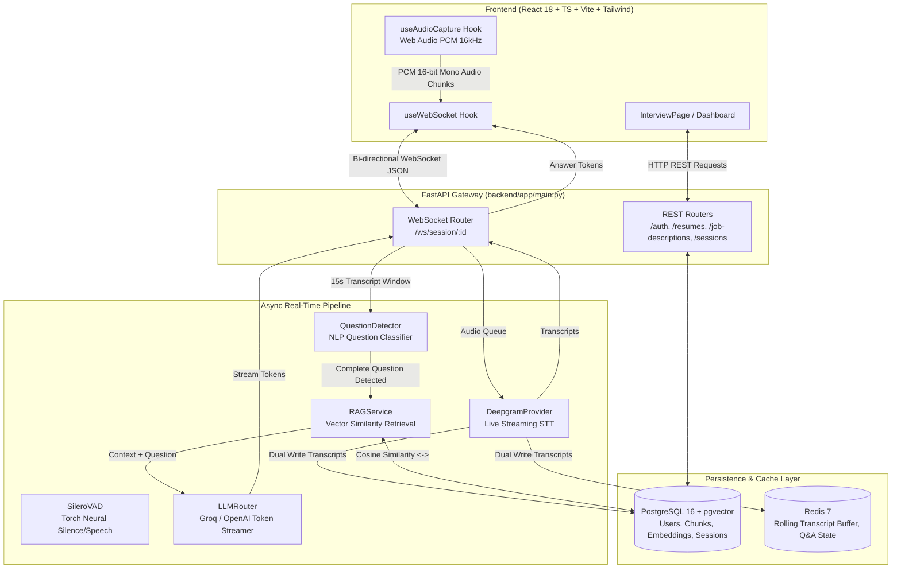
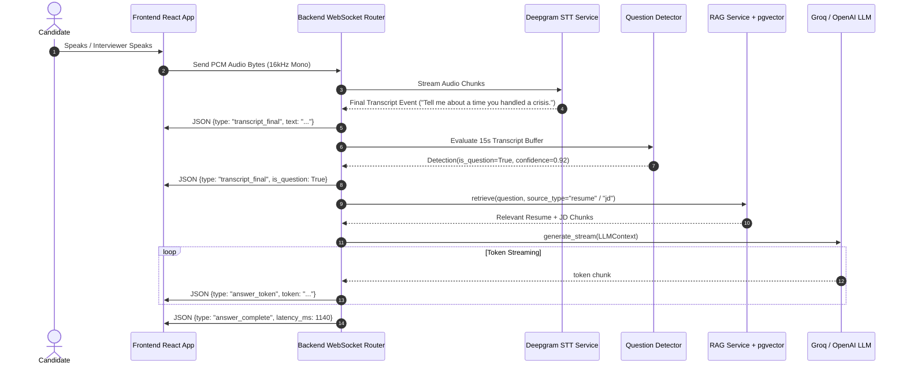
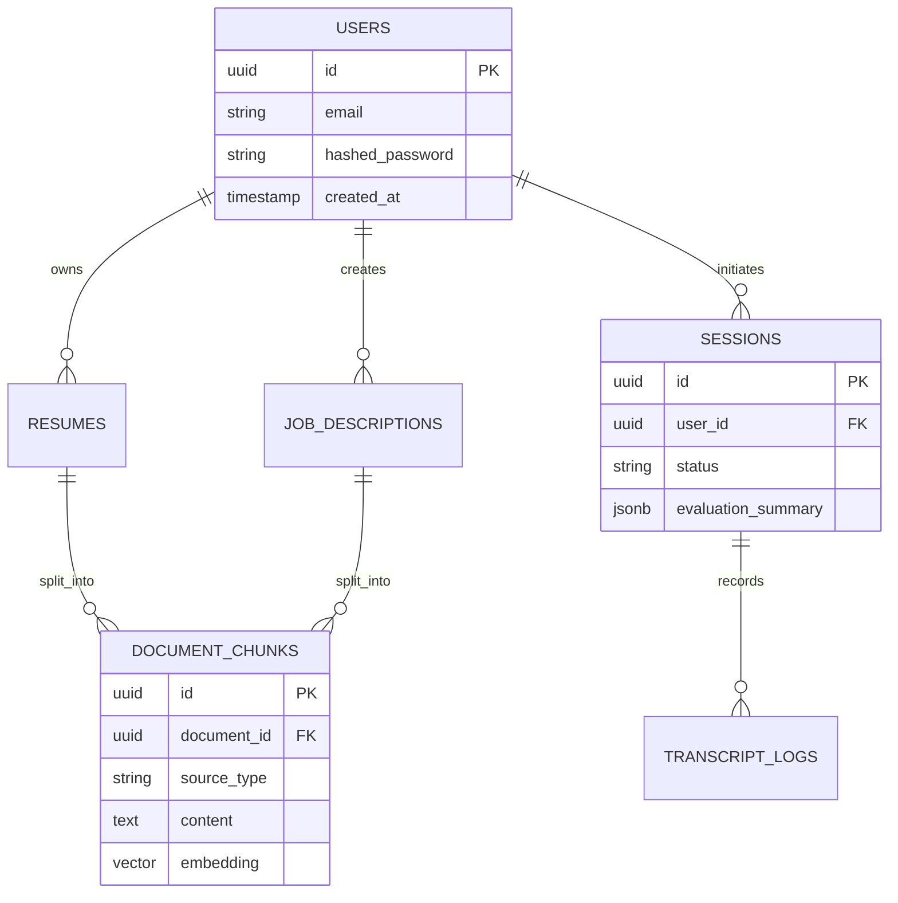

# InterviewCopilot AI — System Architecture, Flow & Technical Documentation

> **Comprehensive Engineering & Architectural Guide for InterviewCopilot AI**  
> **Repository Root:** `e:\IC\`  
> **Version:** 1.0.0  

---

## Table of Contents
1. [Executive Summary & System Purpose](#1-executive-summary--system-purpose)
2. [High-Level Architecture & Component Interaction](#2-high-level-architecture--component-interaction)
3. [End-to-End System Flows](#3-end-to-end-system-flows)
   - [3.1 Real-Time Copilot Audio-to-Answer Flow](#31-real-time-copilot-audio-to-answer-flow)
   - [3.2 Resume & Job Description RAG Ingestion Flow](#32-resume--job-description-rag-ingestion-flow)
   - [3.3 AI Mock Interviewer & Post-Call Evaluation Flow](#33-ai-mock-interviewer--post-call-evaluation-flow)
4. [Backend Architecture & Service Catalog](#4-backend-architecture--service-catalog)
5. [Frontend Architecture & Real-Time Hooks](#5-frontend-architecture--real-time-hooks)
6. [WebSocket Protocol & Message Schema](#6-websocket-protocol--message-schema)
7. [Data Layer & Persistence Strategy](#7-data-layer--persistence-strategy)
8. [Concurrency, Latency Budget & Performance Considerations](#8-concurrency-latency-budget--performance-considerations)
9. [Development & Deployment Infrastructure](#9-development--deployment-infrastructure)

---

## 1. Executive Summary & System Purpose

**InterviewCopilot AI** is a low-latency, real-time AI interview assistant and practice platform. It operates by capturing audio during interview sessions (live interviews or practice sessions), transcribing speech in real-time, detecting structured questions via voice activity detection (VAD) and semantic classification, and instantly synthesizing personalized **STAR-format** (Situation, Task, Action, Result) answers backed by candidate resumes and job description evidence.

### Core Capabilities
- **Real-Time Speech-to-Text (STT):** Continuous streaming transcription with speaker diarization using Deepgram Nova-2.
- **Intelligent End-of-Utterance & Question Detection:** Combines neural Voice Activity Detection (`SileroVAD`) and NLP rule/classifier pipelines (`QuestionDetector`) to reliably distinguish conversational chatter from interview prompts.
- **Low-Latency RAG Engine:** Retrieves top matching chunks from candidate resumes (`pgvector` cosine similarity) and job descriptions to ground LLM responses in real candidate achievements.
- **Token-by-Token Answer Streaming:** Streams structured answers over WebSockets from high-throughput LLMs (`Groq Llama-3-70B` or `OpenAI GPT-4o`).
- **Interactive Practice & Coaching:** Provides mock interviews, floating HUD compact overlays, and post-session evaluation scoring.

---

## 2. High-Level Architecture & Component Interaction



---

## 3. End-to-End System Flows

### 3.1 Real-Time Copilot Audio-to-Answer Flow

The core live co-pilot loop runs completely asynchronously without blocking the event loop:

1. **Audio Capture (`useAudioCapture.ts`):**
   - Captures raw audio via `navigator.mediaDevices.getUserMedia()`.
   - Converts multi-channel audio to 16kHz mono PCM buffers and emits them over the WebSocket connection every ~100–250ms.
2. **WebSocket Ingest (`websocket.py`):**
   - The FastAPI WebSocket handler pushes raw audio bytes into `stt_queue` (`asyncio.Queue`).
3. **Continuous Transcription (`stt/deepgram.py`):**
   - An asynchronous task (`stt_processor`) consumes `stt_queue` and streams frames to Deepgram.
   - Deepgram returns `partial` and `final` transcripts with speaker identifiers.
   - Final transcripts are **dual-written**: immediately appended to Redis for the active 15-second rolling window and persisted to PostgreSQL for auditing/evaluation.
4. **Question Detection (`question_detector.py`):**
   - When an utterance ends (indicated by punctuation or pause), `handle_question()` fetches the last 15 seconds of transcript text from Redis.
   - `QuestionDetector.classify()` scores the text. If `is_question == True` and `confidence >= 0.65`, it triggers the answer pipeline.
5. **RAG Context Retrieval (`rag.py`):**
   - Concurrently executes asynchronous vector similarity queries (`asyncio.gather`) against PostgreSQL (`pgvector`):
     - Top `4` resume chunks matching the question embedding.
     - Top `2` job description chunks matching the question embedding.
6. **Streaming Generation (`llm_router.py`):**
   - Constructs an `LLMContext` prompt formatting candidate experience into structured STAR evidence.
   - Streams LLM output tokens back across the WebSocket (`answer_token`), concluding with `answer_complete`.



---

### 3.2 Resume & Job Description RAG Ingestion Flow

1. **Upload & Extraction (`resumes.py` & `document_parser.py`):**
   - User uploads a `.pdf` or `.docx` resume via the REST API (`POST /resumes/upload`).
   - `DocumentParserService` parses formatted text and splits the document into coherent chunks (~500 tokens with overlap).
2. **Vector Embedding:**
   - Text chunks are embedded using OpenAI `text-embedding-3-small` (1536 dimensions).
3. **Storage in PostgreSQL (`pgvector`):**
   - Stored in the `document_chunks` table indexed with HNSW/IVFFlat for fast vector distance lookups (`<=>`).

---

### 3.3 AI Mock Interviewer & Post-Call Evaluation Flow

- **Interactive Mock Interviewer (`mock_interviewer.py`):**
  - Generates tailored interview questions based on the candidate's uploaded resume and job description.
  - Speaks questions aloud using browser Web Speech Synthesis (`window.speechSynthesis`) or ElevenLabs TTS.
- **Post-Call Evaluation Report (`evaluator.py`):**
  - Analyzes the full session transcript stored in PostgreSQL.
  - Computes a comprehensive **STAR Score (0–100)**, identifies strengths/weaknesses, evaluates keyword coverage, and generates question-by-question model answer suggestions.

---

## 4. Backend Architecture & Service Catalog

The backend follows a clean, decoupled service layer pattern inside `e:\IC\backend\app\`:

```
backend/app/
├── main.py                  # FastAPI entrypoint, environment validation & lifespan management
├── config.py                # Pydantic Settings (.env configuration & secrets)
├── database.py              # Async SQLAlchemy engine & AsyncSessionLocal
├── models/                  # ORM Models (User, Resume, JobDescription, DocumentChunk, Session)
├── routers/
│   ├── auth.py              # JWT authentication & registration endpoints
│   ├── resumes.py           # Resume upload, chunking & vector indexing
│   ├── job_descriptions.py  # JD ingestion & embedding management
│   ├── sessions.py          # Session creation, history & metadata
│   └── websocket.py         # Real-time WebSocket streaming pipeline (/ws/session/{id})
└── services/
    ├── document_parser.py   # Document text extraction (.pdf, .docx, .txt)
    ├── llm_router.py        # Abstract LLM provider interface (Groq & OpenAI streaming)
    ├── question_detector.py # NLP-based question classification & heuristic filtering
    ├── rag.py               # Vector similarity queries using pgvector
    ├── session_manager.py   # Redis-based session caching & rolling transcript buffer
    ├── vad.py               # Torch Silero VAD wrapper
    └── stt/
        ├── base.py          # Base STT provider contract
        └── deepgram.py      # Real-time Deepgram streaming STT integration
```

### Key Service Highlights
- **`validate_environment()` in `main.py`:** Runs strict pre-flight checks on Deepgram API keys, Groq connectivity, database reachability, and `pgvector` extension installation before allowing the application to start.
- **`SessionManager` (`session_manager.py`):** Uses Redis to provide sub-millisecond retrieval of the recent conversation sliding window, preventing repetitive database hits during live speech ingestion.

---

## 5. Frontend Architecture & Real-Time Hooks

The frontend is a modern SPA located in `e:\IC\frontend\src\`:

```
frontend/src/
├── App.tsx                  # Root component & Route setup
├── main.tsx                 # React DOM entry point
├── components/
│   └── Navbar.tsx           # Navigation & Session status header
├── context/
│   └── AuthContext.tsx      # Global JWT authentication & user state
├── hooks/
│   ├── useAudioCapture.ts   # Audio processing worklet & PCM converter
│   └── useWebSocket.ts      # Resilient WebSocket client & message dispatcher
└── pages/
    ├── DashboardPage.tsx    # Resume/JD upload & session launchpad
    ├── InterviewPage.tsx    # Split-screen live copilot & HUD interface
    ├── LoginPage.tsx        # Candidate login
    └── SignupPage.tsx       # Candidate registration
```

### Core Hooks
- **`useAudioCapture()`:**
  - Manages microphone permissions and audio stream lifecycle.
  - Converts browser float32 audio buffers into 16-bit PCM mono at 16,000 Hz for optimal STT compatibility.
- **`useWebSocket()`:**
  - Maintains automatic reconnection logic with exponential backoff.
  - Categorizes incoming WebSocket messages into clean React state updates (`transcripts`, `currentQuestion`, `streamingAnswer`).

---

## 6. WebSocket Protocol & Message Schema

All real-time communication flows through `/ws/session/{session_id}?token={jwt}`.

### Client-to-Server Messages
- **Binary Audio Frames:** Raw PCM 16-bit signed integer audio bytes at 16kHz mono.
- **Control JSON:**
  ```json
  {
    "action": "clear_context"
  }
  ```

### Server-to-Client Messages

#### 1. Partial Transcript (`transcript_partial`)
```json
{
  "type": "transcript_partial",
  "speaker": "0",
  "text": "Can you tell me about a time",
  "is_question": false
}
```

#### 2. Final Transcript / Question Detected (`transcript_final`)
```json
{
  "type": "transcript_final",
  "speaker": "0",
  "text": "Can you tell me about a time you resolved a major production outage?",
  "is_question": true
}
```

#### 3. Answer Token Stream (`answer_token`)
```json
{
  "type": "answer_token",
  "token": "Situation:"
}
```

#### 4. Answer Completion (`answer_complete`)
```json
{
  "type": "answer_complete",
  "full_text": "Situation: At my previous company...\nTask: ...\nAction: ...\nResult: ...",
  "latency_ms": 1180
}
```

#### 5. Status & Rate Limit Notification (`status`)
```json
{
  "type": "status",
  "message": "Rate limited — retrying...",
  "code": "rate_limit"
}
```

---

## 7. Data Layer & Persistence Strategy



### Dual-Storage Architecture
1. **Redis 7 (Hot Path):**
   - Stores transient session state, live speaker transcripts (`recent_transcript`), and rate-limit locks.
   - TTLs ensure automatic cleanup after session termination.
2. **PostgreSQL 16 + pgvector (Cold Path & Vector Index):**
   - Stores users, resumes, job descriptions, complete session history, and 1536-dimensional embedding vectors.

---

## 8. Concurrency, Latency Budget & Performance Considerations

### Concurrency Design
- **Non-Blocking WebSocket Loop:** In `websocket.py`, incoming WebSocket messages (`ws.receive()`) never block on database or LLM calls.
- **Dedicated Coroutines:** Audio streaming (`stt_processor`) and answer generation (`handle_question`) execute concurrently as independent asyncio tasks.
- **De-duplication:** A 15-second suppression window (`last_answered_question`) prevents duplicate LLM invocations for the same repeated question.

### End-to-End Latency Target Budget (< 1,800 ms to First Token)
| Stage | Budget | Component |
| :--- | :--- | :--- |
| Audio Buffer & Transport | ~100–150 ms | WebSocket PCM upload |
| Speech-to-Text (Final Event) | ~250–400 ms | Deepgram Nova-2 Streaming |
| Question Detection | ~15–30 ms | NLP Classifier (`QuestionDetector`) |
| RAG Vector Retrieval | ~40–80 ms | PostgreSQL `pgvector` index query |
| LLM First Token Time (TTFT) | ~300–600 ms | Groq Llama-3-70B API |
| **Total First-Token Latency** | **~705–1,260 ms** | Real-time answer begins appearing |

---

## 9. Development & Deployment Infrastructure

### Local Startup Commands

#### Using Docker Compose (All-in-One Stack)
```powershell
# Launches PostgreSQL (pgvector), Redis, and FastAPI Backend
docker-compose up --build -d
```

#### Running Backend Locally
```powershell
cd backend
.\.venv\Scripts\activate
uvicorn app.main:app --host 0.0.0.0 --port 8000 --reload
```

#### Running Frontend Locally
```powershell
cd frontend
npm install
npm run dev
```

---

## Summary
InterviewCopilot AI combines high-speed streaming audio transcription, neural voice activity detection, vector RAG retrieval, and low-latency LLM streaming to deliver structured, high-value candidate coaching in real time.
